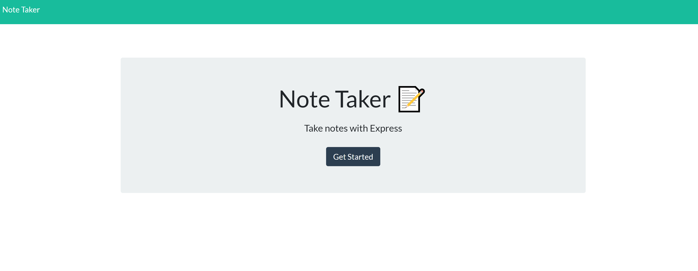
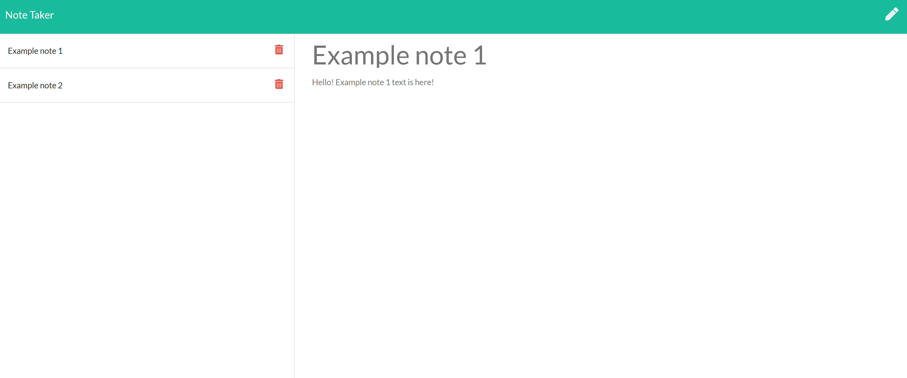

# 11 Express.js: Note Taker

## Task: 
Given front end starter code, my job was to build the back end, connect the two and then deploy the entire application to Heroku. The application must be able to be used to write, save and delete notes using Express.js. It will save and retrieve note data from a JSON file.


### Technologies Used:
JavaScript
Node.js
Express.js
mySQL
npm modules


## User Story

```
AS A small business owner
I WANT to be able to write and save notes
SO THAT I can organize my thoughts and keep track of tasks I need to complete
```


## Final product:

Home page:



Example notes:



### HEROKU URL: https://secure-cliffs-03800.herokuapp.com/heroku 
### GITHUB URL: https://github.com/bripap/express.js-note-taker


